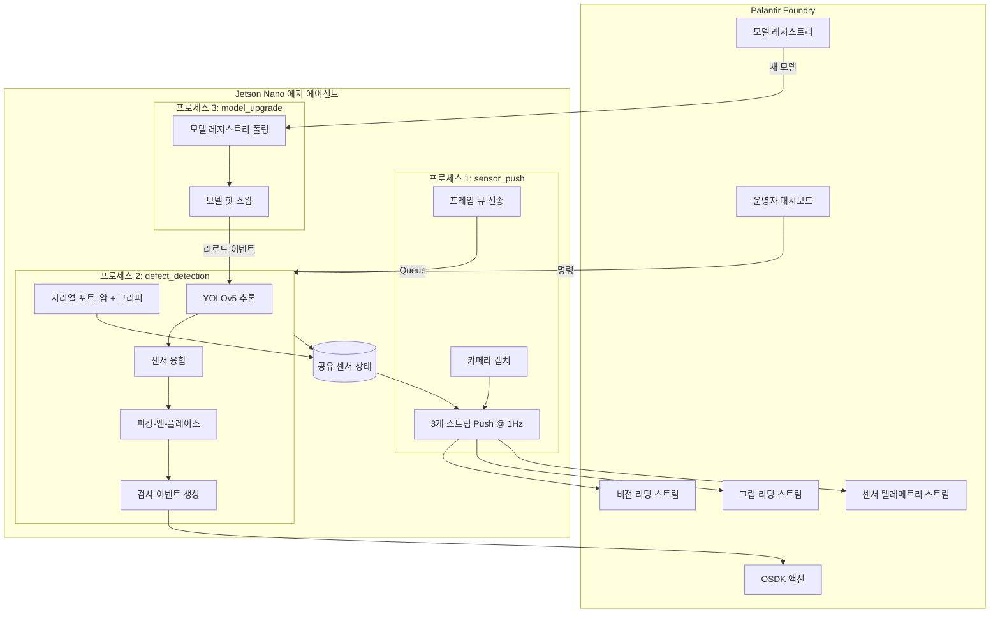

# qa-cell-edge-agent

Physical AI QA Cell을 위한 Jetson Nano 에지 에이전트입니다. 온디바이스 비전
추론을 실행하고, 그리퍼 피드백과 융합하여 부품을 자율적으로 분류하며,
모든 결과를 Palantir Foundry에 보고합니다.

**하드웨어:** myCobot 280 AI Kit 2023 (6축 로봇 암 + 적응형 그리퍼 + 오버헤드
USB 카메라 + 분류 빈), NVIDIA Jetson Nano 2GB  
**SDK:** pymycobot >=3.6.0 (`MyCobot280` 클래스)

## 빠른 시작

### 1. 설치

```bash
git clone <foundry-git-url> qa-cell-edge-agent
cd qa-cell-edge-agent
python3 -m venv venv && source venv/bin/activate

# OSDK 패키지는 Foundry 프라이빗 아티팩트 저장소에서 제공됩니다:
pip install -r requirements.txt --extra-index-url https://<your-stack>.palantirfoundry.com/artifacts/api/repositories/<repo-rid>/contents/release/pypi/simple

pip install -e src/
```

**Jetson Nano 2GB**에서는 GPU 의존성도 설치하세요 (시간이 오래 걸립니다):
```bash
# pycuda는 소스에서 컴파일됩니다 — Nano 2GB에서 ~30분 소요
pip install pycuda>=2022.1
# PyTorch: NVIDIA 공식 Jetson 휠 사용
pip install torch -f https://developer.download.nvidia.com/compute/redist/jp/
```

### 2. Foundry 설정

```bash
cp .env.example .env
# .env 편집 — 필수: FOUNDRY_URL, CLIENT_ID, CLIENT_SECRET, 스트림 RID
```

하드웨어 (시리얼 포트, 카메라)는 **자동 감지**됩니다 — 자동 감지가 잘못된
장치를 선택하지 않는 한 `MYCOBOT_PORT`나 `CAMERA_DEVICE_INDEX`를 설정할 필요가
없습니다.

### 3. 로봇 등록

Foundry에 로봇을 등록합니다 (로봇당 1회 실행):

```bash
python scripts/register_robot.py
```

커스텀 ID를 지정할 수도 있습니다:

```bash
python scripts/register_robot.py --robot-id qa-cell-02 --name "QA Cell Robot 02"
```

### 4. 연결 확인 + 데모 데이터 시딩

```bash
# 8개 항목 연결 확인 (OAuth2, 스트림, OSDK 읽기/쓰기, 쿼리)
python scripts/test_connection.py

# 40개의 현실적인 검사 이벤트 + 스트림 데이터 시딩
python scripts/test_connection.py --seed --count 40
```

### 5. Mock 모드로 실행 (하드웨어 불필요)

```bash
# 완전 Mock — 합성 센서 데이터, Foundry 호출 없음
python -m qa_cell_edge_agent.main --mock
```

세 개의 프로세스가 시작되고 결함 감지 루프가 Mock 추론, 융합 판단,
피킹-앤-플레이스 로깅과 함께 실행되는 것을 확인할 수 있습니다.

### 6. 실제 모델로 실행 (여전히 하드웨어 불필요)

```bash
# YOLOv5-nano ONNX 다운로드 (COCO 사전 학습, ~4 MB)
python scripts/download_model.py

# 실제 ONNX 추론 + Mock 하드웨어로 실행
python -m qa_cell_edge_agent.main --mock-hardware
```

COCO 감지 결과는 `widget_unknown`으로 매핑됩니다 — 프로덕션에서는
`widget_good` / `widget_defect` 클래스용 파인튜닝 모델로 교체하세요.

### 7. 물리적 로봇 설정

myCobot 280 AI Kit을 USB로 연결합니다. **Jetson에서는 먼저 시리얼 포트 그룹에
사용자를 추가하세요:** `sudo usermod -aG dialout $USER` (그 후 로그아웃/로그인).

```bash
# 하드웨어가 감지되고 응답하는지 확인
python scripts/verify_hardware.py

# AI Kit 빈 레이아웃에 맞게 암 웨이포인트 교정
python scripts/calibrate_arm.py

# (선택) 비전 가이드 피킹을 위한 카메라-로봇 변환 교정
python scripts/calibrate_camera.py --method homography --points 6

# 실제 하드웨어 + Mock Foundry로 실행 (테스트용)
python -m qa_cell_edge_agent.main --mock-foundry

# 완전 라이브 실행
python -m qa_cell_edge_agent.main
```

### 8. 서비스로 배포 (Jetson)

```bash
# 사전 준비
sudo usermod -aG dialout jetson          # 시리얼 포트 접근
sudo cp -r . /opt/qa-cell-edge-agent     # /opt에 배포
sudo chown -R jetson:jetson /opt/qa-cell-edge-agent
cp .env /opt/qa-cell-edge-agent/.env     # 인증 정보 복사

# systemd 서비스 설치
sudo cp systemd/qa-cell-edge-agent.service systemd/qa-cell-edge-agent.target /etc/systemd/system/
sudo systemctl daemon-reload
sudo systemctl enable qa-cell-edge-agent.target
sudo systemctl start qa-cell-edge-agent.target

# 모니터링
journalctl -u qa-cell-edge-agent -f
```

## 작동 원리

### Physical AI 루프



1. **캡처** — 오버헤드 카메라 프레임 (프로세스 1, 1Hz)
2. **읽기** — 그리퍼 하중 + 관절 온도 (프로세스 2, 시리얼 연결)
3. **스트리밍** — 비전, 그립, 텔레메트리를 3개 Foundry 스트림에 Push (프로세스 1)
4. **추론** — 온디바이스 YOLOv5 (개발: ONNX / 프로덕션: TensorRT)
5. **융합** — 비전 신뢰도 + 그립 하중 결합 -> PASS / FAIL / REVIEW
6. **분류** — 암이 부품을 집어 올바른 빈에 배치
7. **보고** — 캡처 이미지와 함께 OSDK로 InspectionEvent 생성
8. **위임** — 불확실한 판단 (REVIEW)은 Foundry의 운영자에게 전달
9. **학습** — 운영자 라벨이 모델 재학습에 활용; 프로세스 3이 업데이트된 모델을
   다운로드하여 Jetson에서 핫 스왑

### 아키텍처

`main.py`가 관리하는 3개의 장기 실행 프로세스,
`multiprocessing.Queue` (프레임), `multiprocessing.Event` (모델 리로드),
`multiprocessing.Manager().dict()` (공유 센서 상태)로 통신:

| 프로세스 | 모듈 | 소유 | Push 대상 |
|---------|------|-----|----------|
| **1. 센서 Push** | `sensor_push.py` | 카메라, 스트림 Push | vision-readings, grip-readings, sensor-telemetry (3개 스트림 @ 1Hz) |
| **2. 결함 감지** | `defect_detection.py` | 시리얼 포트 (암 + 그리퍼), 추론, OSDK | InspectionEvent 액션, 센서 상태 기록 |
| **3. 모델 업그레이드** | `model_upgrade.py` | 모델 다운로드 + 변환 | 프로세스 2에 핫 리로드 신호 |

프로세스 2가 시리얼 연결 (`drivers/connection.py` 싱글턴)을 소유하고
그리퍼 하중, 관절 온도, 비전 신뢰도를 공유 딕셔너리에 기록합니다.
프로세스 1이 매 사이클마다 이를 읽어 3개 스트림에 Push합니다
— 따라서 부품이 검사되지 않을 때도 텔레메트리가 연속적으로 흐릅니다.

### 센서 융합

| 비전 | 그립 하중 | 판단 | 이유 |
|------|----------|------|------|
| class=good, conf >= 0.75 | load <= 0.65 | **PASS** | 양쪽 센서 일치 |
| class=defect 또는 conf < 0.75 | load > 0.65 | **FAIL** | 양쪽 센서 일치 |
| 센서 불일치 | — | **REVIEW** | 운영자 검토 필요 |
| 그립 데이터 없음 | — | **REVIEW** | 저하 모드 |

임계값은 `.env`로 설정 가능하며, Foundry 대시보드의 `UPDATE_TOLERANCE`
운영자 명령으로 런타임에 업데이트할 수 있습니다.

### 피킹-앤-플레이스 시퀀스

```
HOME -> PICK (고정 또는 동적) -> 그리퍼 닫기 -> BIN -> 그리퍼 열기 -> HOME
```

카메라 교정이 사용 가능한 경우 (`drivers/camera_calibration.json`), 암이
감지된 바운딩 박스에서 동적 피킹 위치를 계산합니다. 대상이 280mm 작업 영역
밖에 있으면 고정 PICK 웨이포인트로 대체합니다.

### 모델 파이프라인 (ONNX -> TensorRT)

```
Foundry에서 학습 -> ONNX 내보내기 -> ModelRegistry에 게시
    -> 프로세스 3이 다운로드 -> trtexec로 TensorRT 변환 (FP16, 256MB 작업 공간)
    -> 원자적 교체 -> 프로세스 2가 핫 리로드
```

TensorRT 작업 공간은 Jetson Nano 2GB에 맞게 256 MB로 설정됩니다
(`config/jetson.py`에서 설정).

## 스크립트 참조

| 스크립트 | 용도 |
|---------|------|
| `scripts/verify_hardware.py` | 사전 점검: 시리얼 포트 + 카메라 감지, myCobot 통신, 온도 |
| `scripts/register_robot.py` | 1회 설정: Foundry에 Robot 생성. `--robot-id` / `--name`으로 재정의 가능 |
| `scripts/test_connection.py` | 8개 항목 Foundry 연결 확인. `--seed --count N`으로 데모 데이터 생성 |
| `scripts/simulate.py` | 전체 시뮬레이션: 라이브 카메라 + 추론 + Foundry Push, 로봇 하드웨어 불필요 |
| `scripts/calibrate_arm.py` | 대화형: 암을 각 웨이포인트로 이동, 관절 각도를 `waypoints.json`에 기록 |
| `scripts/calibrate_camera.py` | 카메라-로봇 교정. `--method homography` (평면) 또는 `--method handeye` (ArUco) |
| `scripts/download_model.py` | 로컬 추론 테스트용 `yolov5n.onnx` (~4 MB) 다운로드 |

## 설정

모든 설정은 환경 변수 (`.env` 파일 경유)에서 로드됩니다.
하드웨어 포트는 명시적으로 설정하지 않으면 자동 감지됩니다.

| 변수 | 기본값 | 비고 |
|------|-------|------|
| `FOUNDRY_URL` | `https://localhost` | Foundry 스택 URL |
| `CLIENT_ID` / `CLIENT_SECRET` | — | OAuth2 인증 정보 |
| `MYCOBOT_PORT` | 자동 감지 | 예: `/dev/ttyUSB0`으로 재정의 |
| `MYCOBOT_BAUD` | `115200` | myCobot 280 M5Stack 고정 |
| `CAMERA_DEVICE_INDEX` | 자동 감지 | 예: `0`으로 재정의 |
| `TELEMETRY_STREAM_RID` | `.env.example` 참조 | 센서 텔레메트리 시계열 스트림 |
| `MOCK_HARDWARE` | `false` | 모든 하드웨어 I/O 생략 |
| `MOCK_FOUNDRY` | `false` | 모든 Foundry API 호출 생략 |
| `MODEL_PATH` | `./models/yolov5n.onnx` | ONNX 또는 TensorRT 엔진 경로 |
| `CONFIDENCE_THRESHOLD` | `0.75` | 비전 신뢰도 하한 |
| `GRIP_TOLERANCE` | `0.65` | 그립 하중 상한 ("정상" 기준) |
| `CAPTURE_INTERVAL_SEC` | `1.0` | 카메라 캡처 주기 (초) |

## 테스트

```bash
pytest src/test/ -v
```

## Foundry 연동

QA Cell 온톨로지용 생성된 타입 Python SDK인 `physical_ai_qa_cell_sdk`를
사용합니다. 모든 액션 호출과 오브젝트 쿼리는 올바른 매개변수 이름과
타입 안전성을 가진 SDK를 통해 이루어집니다.

**오브젝트 타입:** Robot, Sensor, InspectionEvent, OperatorCommand, ModelRegistry,
VisionReading, GripReading

**액션:** `create_robot`, `create_sensor`, `create_inspection_event`,
`update_robot_status`, `acknowledge_command`, `send_command`, `publish_model`,
`review_inspection_event`

**스트림:** vision-readings, grip-readings, sensor-telemetry (v2 대규모 스트림 API)

**텔레메트리 시리즈:** `j1-temp` ~ `j6-temp` (관절 온도), `vision-confidence`,
`grip-load` — 사이클당 8개 스칼라 리딩, 형식 `{metric}:{robot_id}`

**운영자 명령:** PAUSE, RESUME, E_STOP, UPDATE_TOLERANCE
