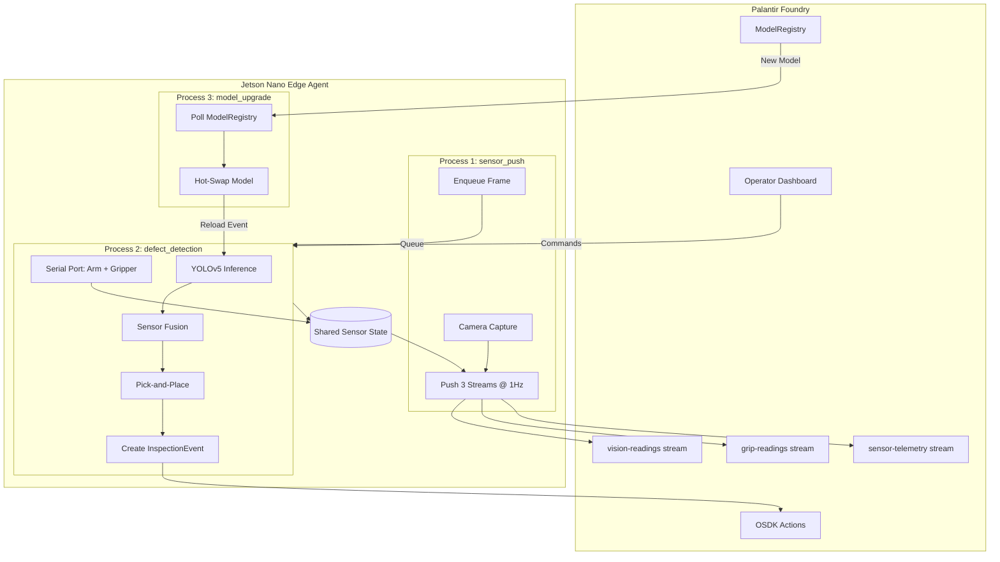

# qa-cell-edge-agent

Jetson Nano edge agent for the Physical AI QA Cell. Runs on-device vision
inference, fuses it with gripper feedback, sorts parts autonomously, and
reports everything to Palantir Foundry.

**Hardware:** myCobot 280 AI Kit 2023 (6-DOF arm + adaptive gripper + overhead
USB camera + sorting bins), NVIDIA Jetson Nano 2GB  
**SDK:** pymycobot >=3.6.0 (`MyCobot280` class)

## Quick Start

### 1. Install

```bash
git clone <foundry-git-url> qa-cell-edge-agent
cd qa-cell-edge-agent
python3 -m venv venv && source venv/bin/activate

# The OSDK package is from a private Foundry artifact repo:
pip install -r requirements.txt --extra-index-url https://<your-stack>.palantirfoundry.com/artifacts/api/repositories/<repo-rid>/contents/release/pypi/simple

pip install -e src/
```

On **Jetson Nano 2GB**, also install the GPU dependencies (these take a while):
```bash
# pycuda compiles from source — expect ~30 min on Nano 2GB
pip install pycuda>=2022.1
# PyTorch: use the official Jetson wheel from NVIDIA
pip install torch -f https://developer.download.nvidia.com/compute/redist/jp/
```

### 2. Configure Foundry

```bash
cp .env.example .env
# Edit .env — REQUIRED: FOUNDRY_URL, CLIENT_ID, CLIENT_SECRET, stream RIDs
```

Hardware (serial port, camera) is **auto-discovered** — no need to set
`MYCOBOT_PORT` or `CAMERA_DEVICE_INDEX` unless auto-detection picks the
wrong device.

### 3. Register the Robot

Register the robot and its sensors in Foundry (run once per robot):

```bash
python scripts/register_robot.py
```

This creates the Robot object and two Sensor objects (camera + gripper) in
the ontology. You can also specify a custom ID:

```bash
python scripts/register_robot.py --robot-id qa-cell-02 --name "QA Cell Robot 02"
```

### 4. Verify Connectivity + Seed Demo Data

```bash
# Run 7-point connectivity check (OAuth2, streams, OSDK read/write, queries)
python scripts/test_connection.py

# Seed 40 realistic inspection events + stream data
python scripts/test_connection.py --seed --count 40
```

### 5. Run in Mock Mode (no hardware needed)

```bash
# Full mock — synthetic sensor data, no Foundry calls
python -m qa_cell_edge_agent.main --mock
```

You should see all three processes start and the defect detection loop
running with mock inference, fusion decisions, and pick-and-place logging.

### 6. Run with a Real Model (still no hardware)

```bash
# Download YOLOv5-nano ONNX (pretrained on COCO, ~4 MB)
python scripts/download_model.py

# Run with real ONNX inference but mocked hardware
python -m qa_cell_edge_agent.main --mock-hardware
```

COCO detections map to `widget_unknown` — replace with a fine-tuned model
for `widget_good` / `widget_defect` classes in production.

### 7. Set Up the Physical Robot

Plug in the myCobot 280 AI Kit via USB. **On Jetson, add your user to the
serial port group first:** `sudo usermod -aG dialout $USER` (then log out/in).

```bash
# Verify hardware is detected and responding
python scripts/verify_hardware.py

# Calibrate arm waypoints for your AI Kit bin layout
python scripts/calibrate_arm.py

# (Optional) Calibrate camera-to-robot transform for vision-guided picking
python scripts/calibrate_camera.py --method homography --points 6

# Run with real hardware, mock Foundry (for testing)
python -m qa_cell_edge_agent.main --mock-foundry

# Run fully live
python -m qa_cell_edge_agent.main
```

### 8. Deploy as a Service (Jetson)

```bash
# Prerequisites
sudo usermod -aG dialout jetson          # serial port access
sudo cp -r . /opt/qa-cell-edge-agent     # deploy to /opt
sudo chown -R jetson:jetson /opt/qa-cell-edge-agent
cp .env /opt/qa-cell-edge-agent/.env     # copy credentials

# Install systemd service
sudo cp systemd/qa-cell-edge-agent.service systemd/qa-cell-edge-agent.target /etc/systemd/system/
sudo systemctl daemon-reload
sudo systemctl enable qa-cell-edge-agent.target
sudo systemctl start qa-cell-edge-agent.target

# Monitor
journalctl -u qa-cell-edge-agent -f
```

## How It Works

### Physical AI Loop



1. **Capture** — overhead camera frame (Process 1, 1Hz)
2. **Read** — gripper load + joint temperatures (Process 2, serial connection)
3. **Stream** — push vision, grip, and telemetry to 3 Foundry streams (Process 1)
4. **Infer** — YOLOv5 on-device (ONNX dev / TensorRT prod)
5. **Fuse** — combine vision confidence + grip load → PASS / FAIL / REVIEW
6. **Sort** — arm picks part and places in the correct bin
7. **Report** — create InspectionEvent with captured image via OSDK
8. **Defer** — uncertain decisions (REVIEW) go to a human operator in Foundry
9. **Learn** — operator labels feed model retraining; Process 3 pulls updated
   models and hot-swaps them on the Jetson

### Architecture

Three long-running processes managed by `main.py`, communicating via
`multiprocessing.Queue` (frames), `multiprocessing.Event` (model reload),
and `multiprocessing.Manager().dict()` (shared sensor state):

| Process | Module | Owns | Pushes |
|---------|--------|------|--------|
| **1. Sensor Push** | `sensor_push.py` | Camera, stream push | vision-readings, grip-readings, sensor-telemetry (all 3 streams @ 1Hz) |
| **2. Defect Detection** | `defect_detection.py` | Serial port (arm + gripper), inference, OSDK | InspectionEvent actions, writes sensor state |
| **3. Model Upgrade** | `model_upgrade.py` | Model download + conversion | Signals Process 2 to hot-reload |

Process 2 owns the serial connection (`drivers/connection.py` singleton)
and writes gripper load, joint temperatures, and vision confidence to a
shared dict. Process 1 reads it every cycle and pushes all three streams
— so telemetry flows continuously even when no parts are being inspected.

### Sensor Fusion

| Vision | Grip Load | Decision | Reason |
|--------|-----------|----------|--------|
| class=good, conf ≥ 0.75 | load ≤ 0.65 | **PASS** | Both sensors agree |
| class=defect OR conf < 0.75 | load > 0.65 | **FAIL** | Both sensors agree |
| Sensors disagree | — | **REVIEW** | Human review required |
| Grip data unavailable | — | **REVIEW** | Degraded mode |

Thresholds are configurable via `.env` and updatable at runtime via the
`UPDATE_TOLERANCE` operator command from the Foundry dashboard.

### Pick-and-Place Sequence

```
HOME → PICK (fixed or dynamic) → close gripper → BIN → release gripper → HOME
```

When camera calibration is available (`drivers/camera_calibration.json`), the
arm computes a dynamic pick position from the detected bounding box. If the
target is outside the 280mm workspace, it falls back to the fixed PICK waypoint.

### Model Pipeline (ONNX → TensorRT)

```
Train in Foundry → export ONNX → publish to ModelRegistry
    → Process 3 downloads → trtexec converts to TensorRT (FP16, 256MB workspace)
    → atomic swap → Process 2 hot-reloads
```

TensorRT workspace is set to 256 MB for the Jetson Nano 2GB (configured in
`config/jetson.py`).

## Project Structure

```
src/
├── qa_cell_edge_agent/
│   ├── config/
│   │   ├── settings.py      # Centralised config from env vars + auto-discovery
│   │   ├── foundry.py       # OSDK client (physical_ai_qa_cell_sdk) + stream push
│   │   ├── sensors.py       # Sensor inventory (series IDs, types, locations)
│   │   └── jetson.py        # Jetson Nano 2GB memory constraints
│   ├── drivers/
│   │   ├── discovery.py     # Auto-detect serial port + camera
│   │   ├── connection.py    # Shared MyCobot280 serial singleton
│   │   ├── arm.py           # Waypoint + Cartesian arm control
│   │   ├── gripper.py       # Gripper read/close/open
│   │   ├── camera.py        # USB camera capture + thumbnails
│   │   └── transforms.py    # Camera-to-robot coordinate transforms
│   ├── fusion/
│   │   └── engine.py        # Sensor fusion decision engine
│   ├── models/
│   │   └── inference.py     # YOLOv5 inference (ONNX + TensorRT + mock)
│   ├── processes/
│   │   ├── sensor_push.py
│   │   ├── defect_detection.py
│   │   └── model_upgrade.py
│   └── main.py              # Process orchestrator
├── scripts/
│   ├── verify_hardware.py   # Pre-flight serial + camera check
│   ├── register_robot.py    # One-time robot registration in Foundry
│   ├── test_connection.py   # 8-point connectivity check + seed data
│   ├── simulate.py          # Full simulation loop with live camera, no robot hardware
│   ├── calibrate_arm.py     # Record arm waypoints for bin layout
│   ├── calibrate_camera.py  # Camera-to-robot calibration (homography / hand-eye)
│   └── download_model.py    # Fetch YOLOv5n ONNX for local testing
└── test/
    └── test_fusion_engine.py
```

## Scripts Reference

| Script | Purpose |
|--------|---------|
| `scripts/verify_hardware.py` | Pre-flight check: serial port + camera detection, myCobot communication, temps |
| `scripts/register_robot.py` | One-time setup: creates Robot in Foundry. `--robot-id` / `--name` to override |
| `scripts/test_connection.py` | 8-point Foundry connectivity check. `--seed --count N` generates demo data |
| `scripts/calibrate_arm.py` | Interactive: move arm to each waypoint, records joint angles to `waypoints.json` |
| `scripts/calibrate_camera.py` | Camera-to-robot calibration. `--method homography` (flat surface) or `--method handeye` (ArUco) |
| `scripts/simulate.py` | Full simulation loop: live camera + inference + Foundry push, no robot needed |
| `scripts/download_model.py` | Downloads `yolov5n.onnx` (~4 MB) for local inference testing |

## Configuration

All settings load from environment variables (via `.env`). Hardware ports
are auto-discovered when not explicitly set.

| Variable | Default | Notes |
|----------|---------|-------|
| `FOUNDRY_URL` | `https://localhost` | Foundry stack URL |
| `CLIENT_ID` / `CLIENT_SECRET` | — | OAuth2 credentials |
| `MYCOBOT_PORT` | auto-detected | Override with e.g. `/dev/ttyUSB0` |
| `MYCOBOT_BAUD` | `115200` | Fixed for myCobot 280 M5Stack |
| `CAMERA_DEVICE_INDEX` | auto-detected | Override with e.g. `0` |
| `TELEMETRY_STREAM_RID` | see `.env.example` | Sensor telemetry time series stream |
| `MOCK_HARDWARE` | `false` | Skip all hardware I/O |
| `MOCK_FOUNDRY` | `false` | Skip all Foundry API calls |
| `MODEL_PATH` | `./models/yolov5n.onnx` | Path to ONNX or TensorRT engine |
| `CONFIDENCE_THRESHOLD` | `0.75` | Vision confidence floor |
| `GRIP_TOLERANCE` | `0.65` | Gripper load ceiling for "normal" |
| `CAPTURE_INTERVAL_SEC` | `1.0` | Camera capture rate (seconds) |

## Testing

```bash
pytest src/test/ -v
```

## Foundry Integration

Uses `physical_ai_qa_cell_sdk` (v0.5.0) — a generated typed Python SDK for
the QA Cell ontology. All action calls and object queries go through the SDK
with correct parameter names and type safety.

**Object types:** Robot, Sensor, InspectionEvent, OperatorCommand, ModelRegistry,
VisionReading, GripReading

**Actions:** `create_robot`, `create_sensor`, `create_inspection_event`,
`update_robot_status`, `acknowledge_command`, `send_command`, `publish_model`,
`review_inspection_event`

**Streams:** vision-readings, grip-readings, sensor-telemetry (v2 high-scale streams API)

**Telemetry series:** `j1-temp` through `j6-temp` (joint temps), `vision-confidence`,
`grip-load` — 8 scalar readings per cycle, format `{metric}:{robot_id}`

**Operator Commands:** PAUSE, RESUME, E_STOP, UPDATE_TOLERANCE
